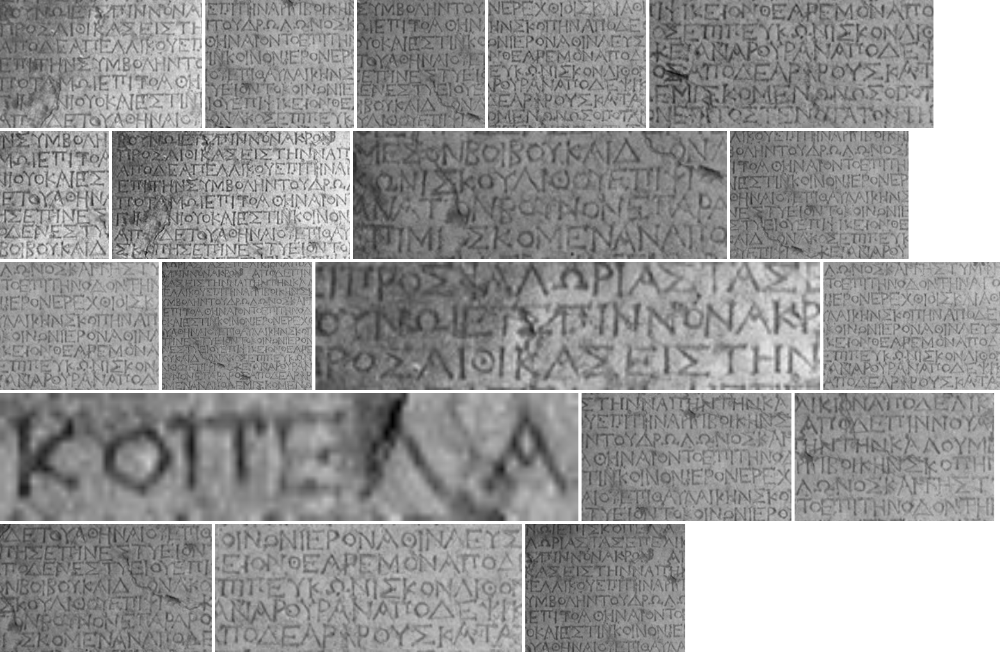
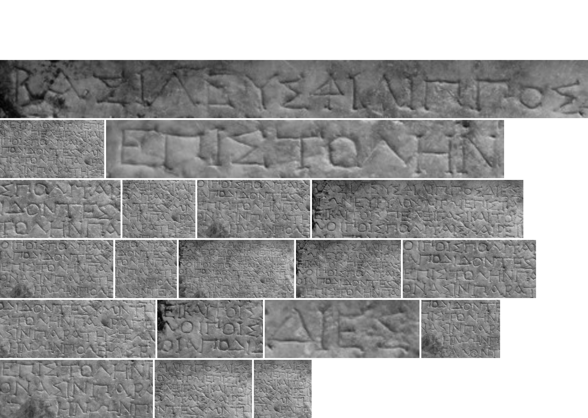
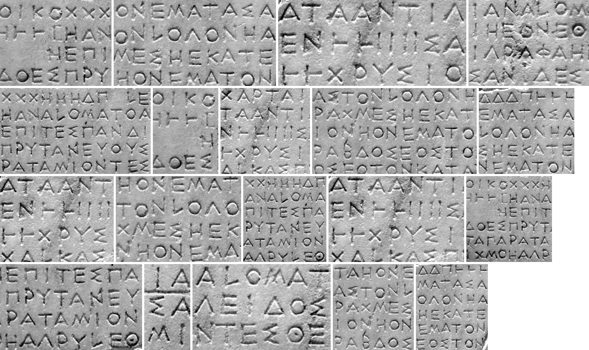
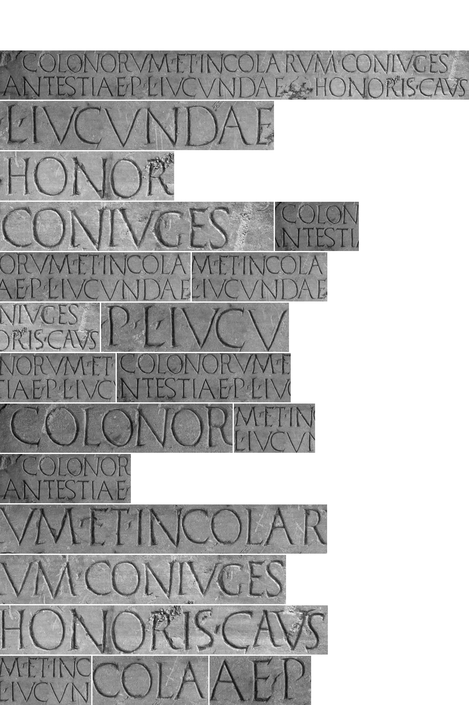
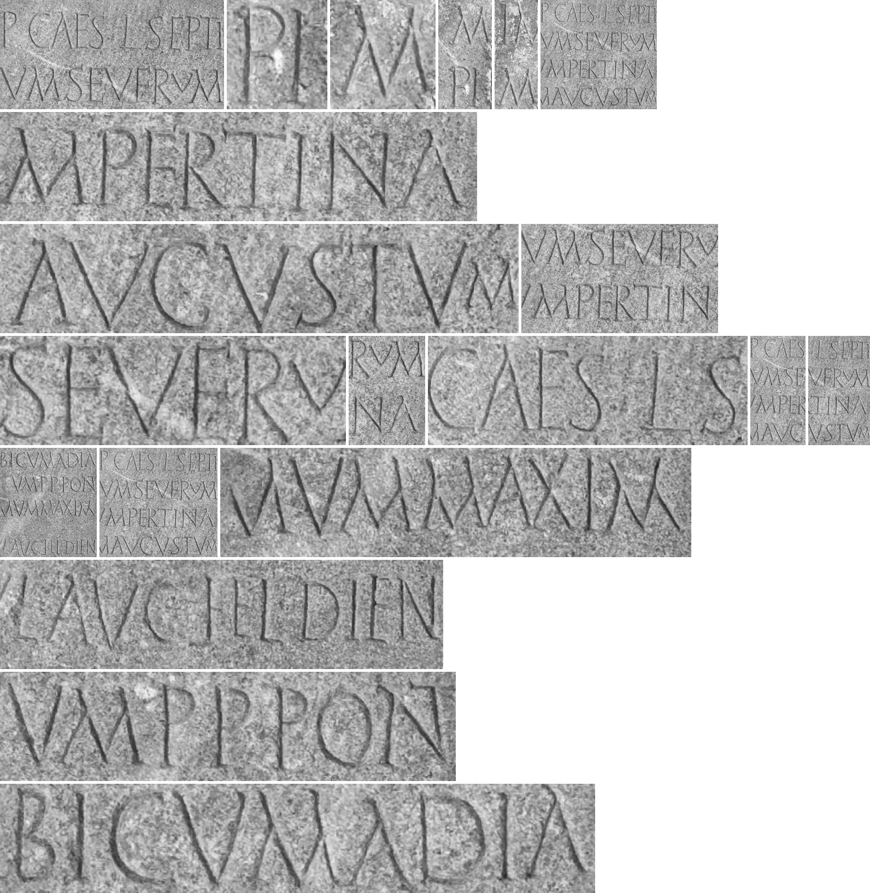

# Inscription Texture Restoration

MESA - A Training-Free Multi-Exemplar Deep Framework for Restoring Ancient Inscription Textures

Download datasets for training MESA and all other methods that need training and are comparable to our method from here:

https://drive.google.com/file/d/1cdpitRfraO1QmyQnqSRVv_I3tkeU9fv_/view?usp=sharing

## Dataset Insights and Additional Experiments
### Dataset A

*Dataset A used as exemplars in MESA or as ground truth in techniques that require supervised learning.*

---

### Dataset B

*Dataset B used as exemplars in MESA or as ground truth in techniques that require supervised learning.*

---

### Dataset C

*Dataset C used as exemplars in MESA or as ground truth in techniques that require supervised learning.*

---

### Dataset D

*Dataset D used as exemplars in MESA or as ground truth in techniques that require supervised learning.*

---

### Dataset E

*Dataset E used as exemplars in MESA or as ground truth in techniques that require supervised learning.*